# 10px AI React - 产品需求文档 (可视化版本)

## 📋 文档信息

- **产品名称**: 10px AI React (Neutrade)
- **文档版本**: v1.0 (可视化版)
- **创建日期**: 2024年12月
- **产品类型**: 智能金融交易分析平台

---

## 🎯 产品架构图

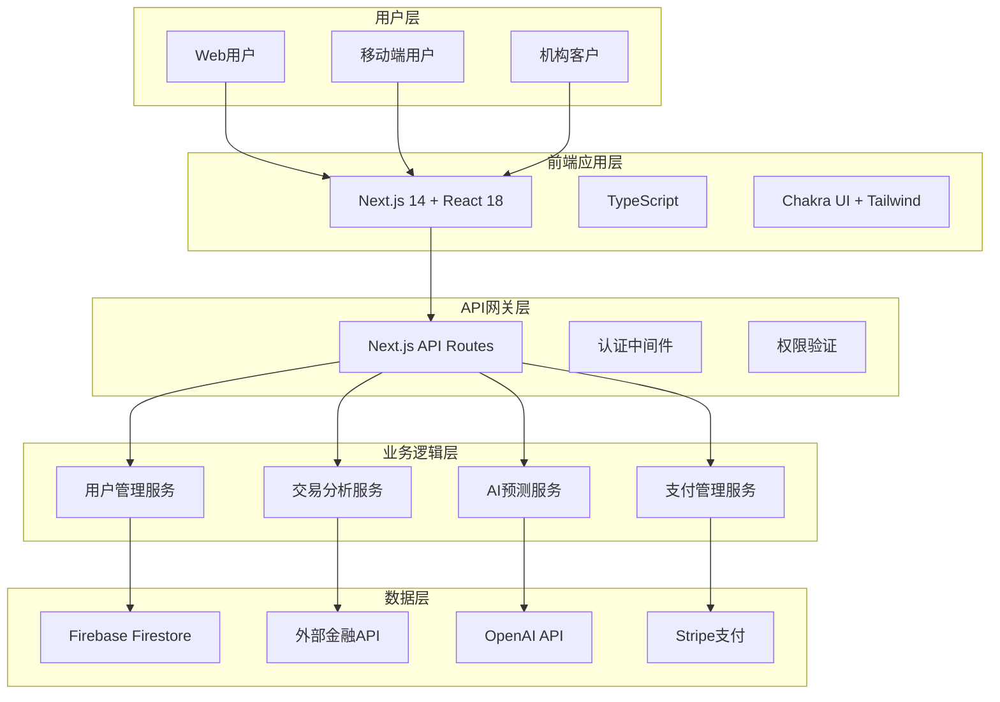

---

## 🏗️ 系统架构图

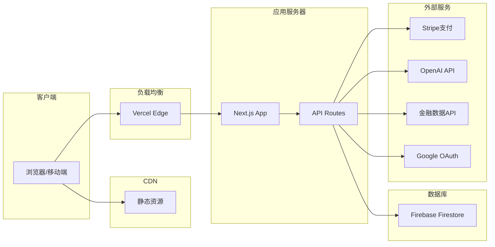

---

## 📱 功能模块架构

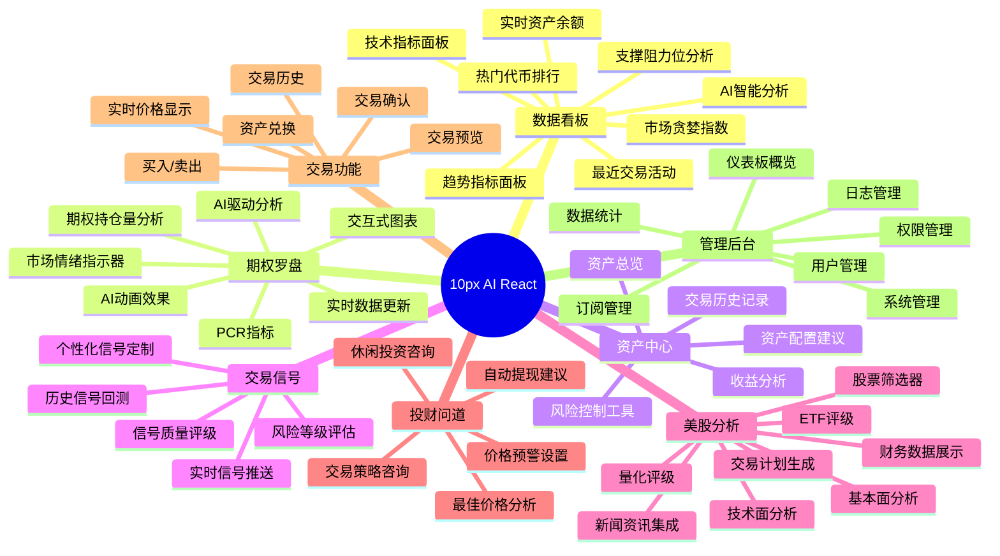

---

## 💰 商业模式流程图

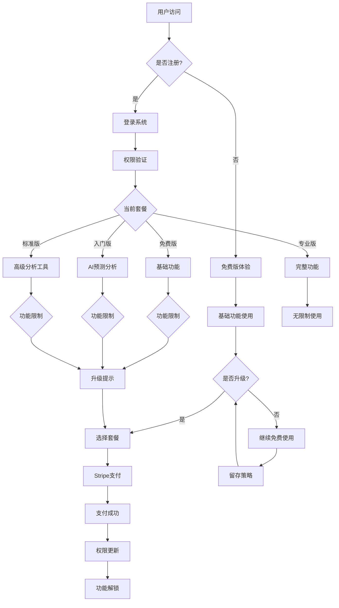

---

## 🔐 用户权限矩阵

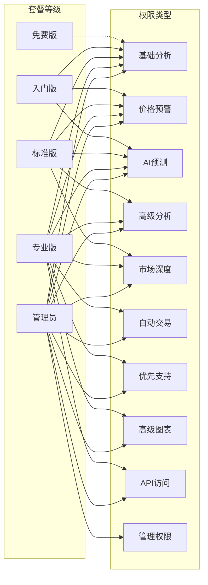

---

## 📊 用户旅程图

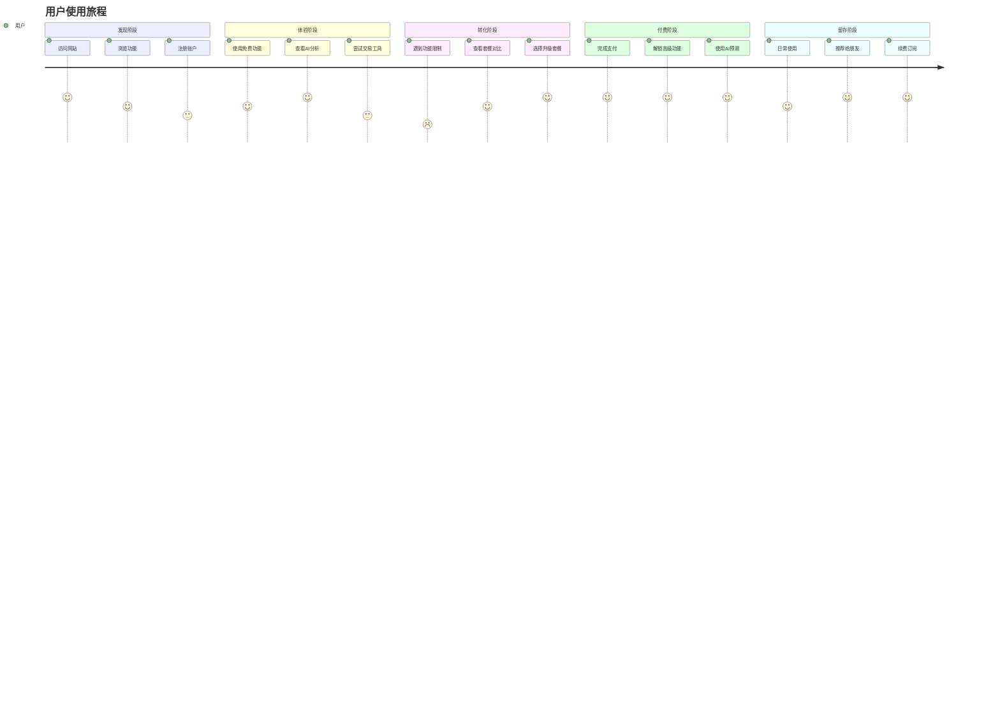

---

## 🎯 产品功能优先级矩阵

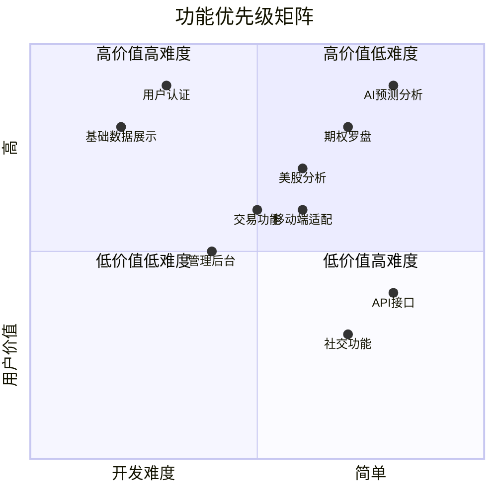

---

## 📈 业务指标仪表板

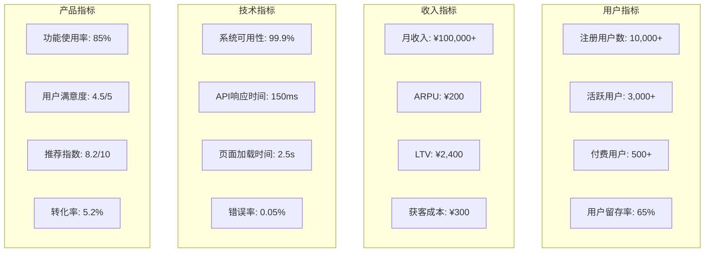

---

## 🚀 开发路线图

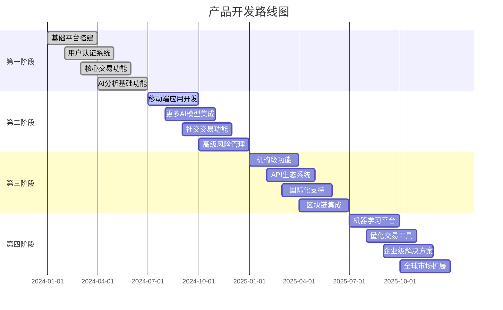

---

## 🔄 数据流程图

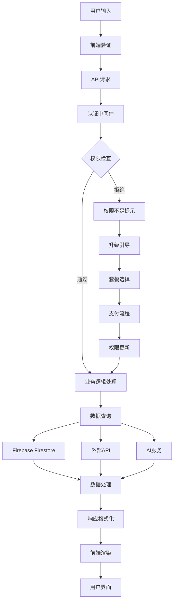

---

## 🎨 UI/UX 组件架构

```mermaid
graph TB
    subgraph "布局组件"
        A[Layout]
        B[Header]
        C[Sidebar]
        D[Footer]
    end
    
    subgraph "数据展示组件"
        E[Chart组件]
        F[Table组件]
        G[Card组件]
        H[Modal组件]
    end
    
    subgraph "交互组件"
        I[Button组件]
        J[Form组件]
        K[Select组件]
        L[Input组件]
    end
    
    subgraph "AI动画组件"
        M[AILoadingAnimation]
        N[MarketSentimentIndicator]
        O[DataVisualizationAnimation]
        P[AIAnalysisResultAnimation]
    end
    
    subgraph "业务组件"
        Q[Trade组件]
        R[Analysis组件]
        S[User组件]
        T[Admin组件]
    end
    
    A --> B
    A --> C
    A --> D
    A --> E
    A --> F
    A --> G
    A --> H
    A --> I
    A --> J
    A --> K
    A --> L
    A --> M
    A --> N
    A --> O
    A --> P
    A --> Q
    A --> R
    A --> S
    A --> T
```

---

## 📊 技术栈依赖图

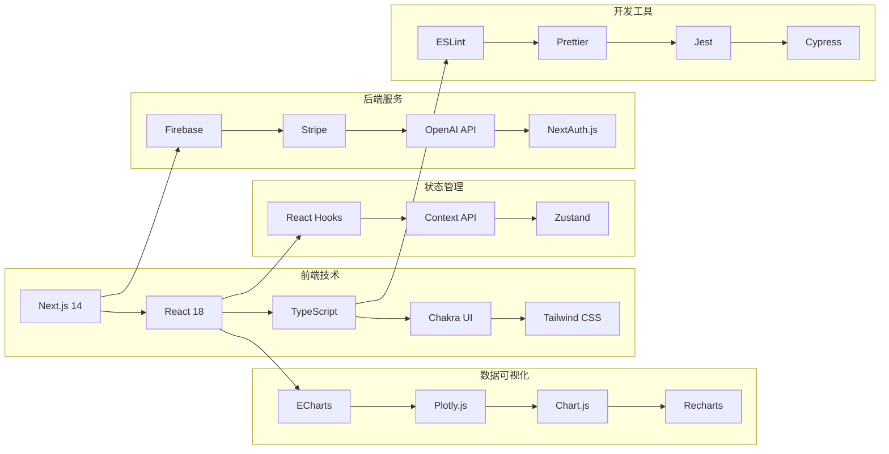

---

## 🎯 成功指标仪表板

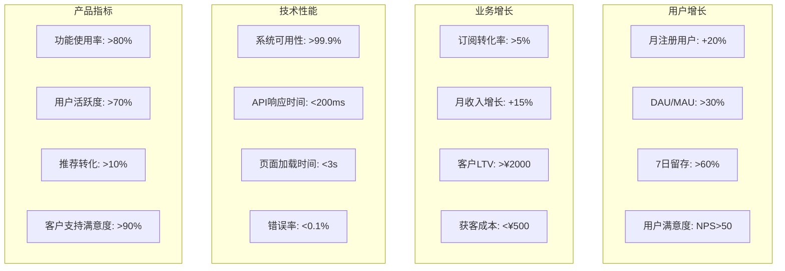

---

## 📋 总结

这份可视化PRD文档通过多种图表类型展示了：

1. **系统架构图** - 清晰展示技术架构层次
2. **功能模块图** - 思维导图展示所有功能模块
3. **商业模式流程图** - 用户转化和付费流程
4. **权限矩阵图** - 不同套餐的权限分配
5. **用户旅程图** - 完整的用户体验流程
6. **优先级矩阵** - 功能开发优先级
7. **甘特图** - 产品开发时间线
8. **数据流程图** - 系统数据处理流程
9. **组件架构图** - UI组件层次结构
10. **技术栈图** - 技术依赖关系
11. **指标仪表板** - 关键业务指标

这些可视化图表帮助团队更好地理解产品架构、业务流程和技术实现，便于沟通和决策。

---

**文档结束**

*本可视化PRD文档使用Mermaid图表语法编写，可在支持Mermaid的平台上直接渲染。* 